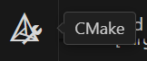
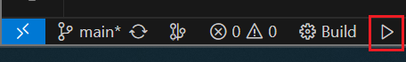
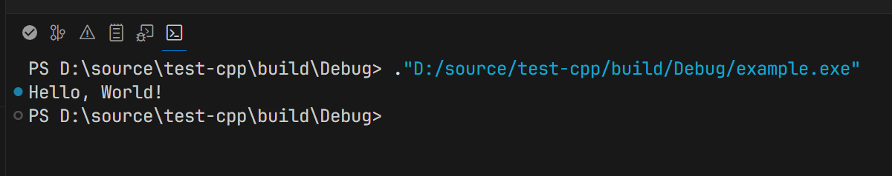

+++
date = "2025-07-15T20:53:53+08:00"
# lastmod = "2025-07-15T20:53:53+08:00"
draft = false
title = "VSCode上配置C++开发环境（clangd+cmake）"
summary = "我个人配置 VSCode 上 C++ 开发环境的方法，同时也是我的常用配置"
+++

我个人配置 VSCode 上 C++ 开发环境的方法，同时也是我的常用配置

## 安装

- 安装编译器（GCC/MSVC）

略

- 安装 LLVM（提供clangd，可选）、CMake、Ninja

Ninja 是一个以速度为目标的构建系统，为 CMake 一类的构建配置生成器使用

我使用 [Scoop](https://scoop.sh/) （Windows）安装，更加方便，也可以从官网下载安装包使用。

```shell
scoop install cmake llvm ninja
```

### VSCode安装插件

- C/C++ Extension Pack

用于快速配置debugger等

- clangd

为 C++ 提供了更高级的智能补全、错误检查、自动格式化等

- CMake Tools & CMake

前者提供了 CMake 的侧边栏和调试配置等内容，后者提供了更好的[hover信息](https://code.visualstudio.com/api/language-extensions/programmatic-language-features#show-hovers)

```shell
code --install-extension ms-vscode.cpptools-extension-pack llvm-vs-code-extensions.vscode-clangd ms-vscode.cmake-tools twxs.cmake
```

## 配置

### 配置 clangd

#### 插件配置

VSCode 内 `F1`/`Ctrl+Shift+P` 输入并选择 `Preferences: Open User Settings (JSON)`，将如下配置插入到末尾

```json
// 关闭另一个插件的 C++ IntelliSense
"C_Cpp.intelliSenseEngine": "disabled",
"[cpp]": {
    "editor.defaultFormatter": "llvm-vs-code-extensions.vscode-clangd",
},
"clangd.arguments": [
    // 读取config.yaml中配置的内容
    "--enable-config",
    "--all-scopes-completion",
    // 补全模式：detailed(区分不同函数签名)/bundled(合并函数名相同，签名不同的函数)
    "--completion-style=detailed",
    // 默认的 clang-format 样式
    "--fallback-style=LLVM",
    // 自动插入include，不一定是你想要的那个
    "--header-insertion=iwyu",
    // 缓存：disk(存放在${workspaceFolder}/.cache，需要加入到.gitignore)/memory
    "--pch-storage=disk",
    // 线程数量
    // "-j=8",
    // 启用 clang-tidy
    "--clang-tidy"
],
```

#### config.yaml

VSCode 内 `F1`/`Ctrl+Shift+P` 输入并选择 `clangd: Open user configuration file`，在新打开的文件内根据 [clangd Configuration](https://clangd.llvm.org/config) 配置。

以下是我的配置，使用 `---` 划分为三个部分，需要和 `If` 搭配使用。第一个部分是通用的 C++ 项目配置，在 Windows 上需要保证 `CompileFlags/Compiler` 为 `clang-cl` 才能更方便地使用 clangd。第二个部分是针对不同文件匹配的模板和两个示例，默认不匹配任何内容。第三部分是全局配置，包含 ClangTidy 和其他相应配置

```yaml
# ref: https://clangd.llvm.org/config
# should create project-specific configuration in the root folder

If:
  PathExclude: [.*\.c, .*\.h]
CompileFlags:
  # Add:
  #   - -std:c++20
  # Remove:
  #   - -std*
  Compiler: clang-cl
Style:
  QuotedHeaders: ["src/.*"]
  AngledHeaders: ["third-party/.*", "3rd/.*"]

---
If:
  PathMatch: $^
  PathExclude: .*
CompileFlags:
  Add:
    - -std=[c++23/c17]
    - -x[c++/c++-header/c/c-header]
    - -isystem-after "absolute/include/path"
    - -D KEY=VALUE
  Remove:
    - -std*
    - -x*
  Compiler: clang[/++]
Style:
  QuotedHeaders: ["src/.*"]
  AngledHeaders: ["third-party/.*"]

# # c source
# If:
#   PathMatch: .*\.c
# CompileFlags:
#   Add:
#     - -std=c17
#     - -xc
#   Remove:
#     - -std
#     - -x*
#   Compiler: clang

# # c header
# If:
#   PathMatch: .*\.h
# CompileFlags:
#   Add:
#     - -std=c17
#     - -xc-header
#   Remove:
#     - -std
#     - -x*
#   Compiler: clang

---
# global configuration

Index:
  Background: Build
  StandardLibrary: true
Diagnostics:
  Suppress: []
  ClangTidy:
    Add:
      - bugprone-*
      - cppcoreguidelines-*
      - modernize-*
      - performance-*
      - readability-*
    Remove:
      - modernize-use-std-print
      - bugprone-easily-swappable-parameters
      - modernize-use-trailing-return-type
      - cppcoreguidelines-owning-memory
      - performance-avoid-endl
      - readability-identifier-length
      - readability-qualified-auto
    # CheckOptions:
    #   readability-identifier-naming.VariableCase: CamelCase
    FastCheckFilter: Loose
  UnusedIncludes: Strict
  Includes:
    IgnoreHeader: []
    AnalyzeAngledIncludes: false
  MissingIncludes: Strict
Completion:
  AllScopes: true
InlayHints:
  Enabled: true
  ParameterNames: true
  DeducedTypes: true
  Designators: true
  BlockEnd: false
  TypeNameLimit: 24
Hover:
  ShowAKA: true
SemanticTokens:
  DisabledKinds: []
  DisabledModifiers: []
```

### 配置 clang-format



请注意，如果你希望保存时自动格式化，请配置 `"editor.formatOnSave": true`，更多自动格式化选项请搜索 `format`



#### .clang-format

在项目的根目录或者项目目录的任何父目录中创建文件 `.clang-format` 并根据 [Clang Format Style Options](https://clang.llvm.org/docs/ClangFormatStyleOptions.html) 配置

以下是我的配置

```yaml
BasedOnStyle: LLVM

# indent - general
IndentWidth: 4
TabWidth: 4
UseTab: Never
ColumnLimit: 120
# indent - specific
IndentAccessModifiers: false
AccessModifierOffset: -2
IndentCaseLabels: false
IndentWrappedFunctionNames: true
LambdaBodyIndentation: Signature

# align
AlignTrailingComments: true

# empty line
MaxEmptyLinesToKeep: 1
SeparateDefinitionBlocks: Leave
EmptyLineBeforeAccessModifier: LogicalBlock
EmptyLineAfterAccessModifier: Leave

# code break
BreakStringLiterals: false
AlwaysBreakTemplateDeclarations: Yes
AllowShortIfStatementsOnASingleLine: false
AllowShortLoopsOnASingleLine: false
AllowShortFunctionsOnASingleLine: All
AllowShortEnumsOnASingleLine: false
BinPackArguments: true
BinPackParameters: true
# BreakBeforeBraces: Custom
# BraceWrapping:
#   AfterCaseLabel: false
#   AfterClass: ture
#   AfterEnum: false
#   AfterStruct: false
#   SplitEmptyFunction: false

# misc
PointerAlignment: Left
```

### 配置 cmake

#### 插件配置

VSCode 内 `F1`/`Ctrl+Shift+P` 输入并选择 `Preferences: Open User Settings (JSON)`，将如下配置插入到末尾

```json
"cmake.generator": "Ninja",
"cmake.preferredGenerators": [
    "Ninja",
],
"cmake.launchBehavior": "breakAndReuseTerminal",
"cmake.sourceDirectory": "${workspaceFolder}",
"cmake.pinnedCommands": [
    "cmake.quickStart",
    "cmake.configure",
    "cmake.cleanConfigure",
    "cmake.build",
    "cmake.cleanRebuild",
    "cmake.launchTarget",
],
"cmake.options.advanced": {
    "build": {
        "statusBarVisibility": "visible",
        "inheritDefault": "visible"
    },
    "launch": {
        "statusBarVisibility": "visible",
        "inheritDefault": "visible"
    },
    "debug": {
        "statusBarVisibility": "hidden",
        "inheritDefault": "visible"
    }
},
// 这三个关闭了自动配置，如果你需要相应功能就删除
"cmake.configureOnEdit": false,
"cmake.configureOnOpen": false,
"cmake.automaticReconfigure": false,
```

#### CMakePresets.json

在项目根目录创建文件 `CMakePresets.json` 并根据 [CMake Presets](https://cmake.org/cmake/help/latest/manual/cmake-presets.7.html#introduction) 配置

以下是我的配置，如果你不使用vcpkg，删除 `toolchainFile`

```json
{
    "version": 8,
    "configurePresets": [
        {
            "name": "base",
            "hidden": true,
            "generator": "Ninja Multi-Config",
            "binaryDir": "${sourceDir}/build",
            "installDir": "${sourceDir}/build/install/${presetName}",
            "toolchainFile": "$env{VCPKG_ROOT}/scripts/buildsystems/vcpkg.cmake",
            "cacheVariables": {
                "CMAKE_EXPORT_COMPILE_COMMANDS": "true"
            }
        },
        {
            "name": "native",
            "inherits": "base",
            "displayName": "Native",
            "condition": {
                "type": "notEquals",
                "lhs": "${hostSystemName}",
                "rhs": "Windows"
            }
        },
        {
            "name": "msvc-x64",
            "inherits": "base",
            "displayName": "Native - MSVC x64",
            "architecture": {
                "value": "x64",
                "strategy": "external"
            },
            "toolset": {
                "value": "host=x64",
                "strategy": "external"
            },
            "cacheVariables": {
                "CMAKE_C_COMPILER": "cl.exe",
                "CMAKE_CXX_COMPILER": "cl.exe"
            },
            "condition": {
                "type": "equals",
                "lhs": "${hostSystemName}",
                "rhs": "Windows"
            }
        }
    ],
    "buildPresets": [
        {
            "name": "native",
            "configurePreset": "native",
            "displayName": "Ninja Multi-Config"
        },
        {
            "name": "native-debug",
            "inherits": "native",
            "displayName": "Native Debug",
            "configuration": "Debug"
        },
        {
            "name": "native-release",
            "inherits": "native",
            "displayName": "Native Release",
            "configuration": "Release"
        },
        {
            "name": "native-relwithdebinfo",
            "inherits": "native",
            "displayName": "Native RelWithDebInfo",
            "configuration": "RelWithDebInfo"
        },
        {
            "name": "msvc-x64",
            "configurePreset": "msvc-x64",
            "displayName": "Ninja Multi-Config - MSVC x64"
        },
        {
            "name": "msvc-x64-debug",
            "inherits": "msvc-x64",
            "displayName": "Native Debug - MSVC x64",
            "configuration": "Debug"
        },
        {
            "name": "msvc-x64-release",
            "inherits": "msvc-x64",
            "displayName": "Native Release - MSVC x64",
            "configuration": "Release"
        },
        {
            "name": "msvc-x64-relwithdebinfo",
            "inherits": "msvc-x64",
            "displayName": "Native RelWithDebInfo - MSVC x64",
            "configuration": "RelWithDebInfo"
        }
    ]
}
```

## 运行

新建一个文件夹，创建 `main.cpp` 文件，写入测试代码：

```cpp
#include <iostream>

int main() {
    std::cout << "Hello, World!" << std::endl;
    return 0;
}
```

VSCode 内 `F1`/`Ctrl+Shift+P` 输入并选择 `CMake: Quick Start`

- 输入项目名称 `example`
- 选择 C++
- 选择 Executable
- 不选中 CPack/CTest，点击OK
- 选择 `main.cpp`，点击OK

此时自动创建的 `CMakeLists.txt` 将会出现，同时左侧边栏会出现 CMake 的按钮



选中后会出现相应的设置项，但是现在我们先不管。单击下方状态栏中的运行按钮或者按 `F5`（调试运行）/`Ctrl+F5`（运行）



此时就会正确运行项目

