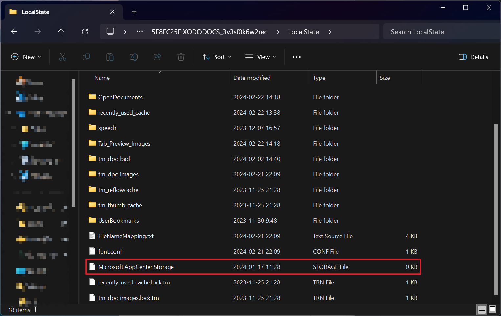
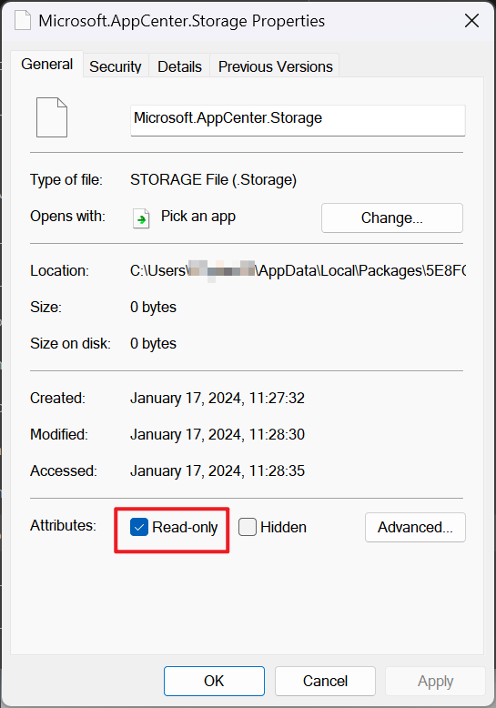

+++
date = "2024-02-23T19:59:00+08:00"
lastmod = "2025-01-06T21:50:00+08:00"
draft = false
title = "解决 Xodo PDF 阅读器无法启动的方法之一"
summary = "`Microsoft.AppCenter.Storage` 文件导致的奇怪问题"
+++

个人遇到的的问题，找到解决方法后记录一下

## 问题

尝试启动 Xodo 时卡在启动界面，无响应

## 适用范围

如果删除 `C:\Users\[username]\AppData\Local\Packages\5E8FC25E.XODODOCS_3v3sf0k6w2rec\LocalState\Microsoft.AppCenter.Storage` 可使 Xodo 正常运行则可用此解决方法  
（即`%AppData%\..\Local\Packages\5E8FC25E.XODODOCS_3v3sf0k6w2rec\LocalState\Microsoft.AppCenter.Storage`）

### 解决方法

打开到 `C:\Users\[username]\AppData\Local\Packages\5E8FC25E.XODODOCS_3v3sf0k6w2rec\LocalState`
（即`%AppData%\..\Local\Packages\5E8FC25E.XODODOCS_3v3sf0k6w2rec\LocalState`）

将文件 `Microsoft.AppCenter.Storage` 删除后创建同名空文件，设置只读属性

此时 Xodo 应当能正常打开

### 其他信息

- `Microsoft.AppCenter.Storage`

sqlite 文件，包含日志信息

以及我问 Xodo 官方的结果（当然没得到什么有用的帮助

[https://feedback.xodo.com/support/tickets/67636](https://link.zhihu.com/?target=https%3A//feedback.xodo.com/support/tickets/67636)

---

2024-05-01 edit：才发现好像其他人看不了，现在把回复贴在这里：

> Hello,  
> Thank you for your patience so far.  
>   
> After some time for testing, our team was not able to reproduce the reported issue. Can you please let us know if the issue is still happening for you and if you have tried reinstalling your Xodo application?  
>   
> Check your ticket status - [https://feedback.xodo.com/support/tickets/67636](https://link.zhihu.com/?target=https%3A//feedback.xodo.com/support/tickets/67636)  
>   
> Best regards,  
> Andrea  
> Technical Support Analyst